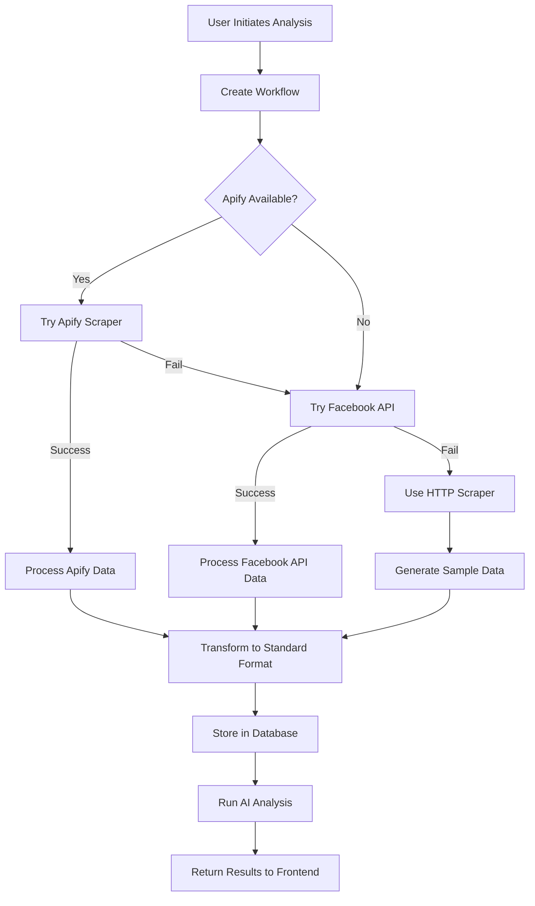

# Facebook Ads Scraping System Documentation

## Overview

This system provides a comprehensive Facebook ads competitive analysis platform with multiple scraping methods, intelligent fallback mechanisms, and real-time token validation. The system automatically switches between different data sources to ensure maximum reliability and data availability.

## Architecture

### Multi-Tier Scraping Strategy

The system employs a **3-tier fallback approach** to maximize data collection success:

```
1. Apify Scraper (Premium) → 2. Facebook API (Official) → 3. HTTP Scraper (Fallback)
```

### System Components

#### Backend Components
- **Express.js API Server** (`src/index.js`)
- **Multi-Scraper Engine** (`src/scrapers/`)
- **Token Validation System** (`src/api/routes.js`)
- **Database Layer** (SQLite - `src/database/`)
- **Logging System** (Winston - `src/utils/logger.js`)

#### Frontend Components
- **Angular 17 SPA** (`frontend/`)
- **Dashboard Interface** (Token management, analysis results)
- **Real-time Progress Tracking**
- **Data Visualization Components**

## Scraping Methods

### 1. Apify Scraper (`src/scrapers/apify-scraper.js`)
**Status**: Primary method (when configured)
**Requires**: Apify API token
**Data Quality**: High-quality structured data
**Rate Limits**: Based on Apify plan

```javascript
// Usage
const scraper = new ApifyScraper();
const results = await scraper.scrapeAds({
  query: 'nike',
  limit: 50,
  region: 'US'
});
```

**Pros**:
- Highest data quality and reliability
- Built-in anti-detection measures
- Structured, clean data output
- Commercial support

**Cons**:
- Requires paid subscription
- External dependency

### 2. Facebook API Client (`src/scrapers/facebook-api-client.js`)
**Status**: Secondary method
**Requires**: Facebook Access Token with Ad Library API permissions
**Data Quality**: Official Facebook data (highest accuracy)
**Rate Limits**: 180 requests/hour

```javascript
// Usage
const client = new FacebookAdLibraryAPI();
const results = await client.scrapeAds({
  query: 'nike',
  limit: 50,
  region: 'US'
});
```

**Pros**:
- Official Facebook data
- Most accurate and up-to-date information
- Access to comprehensive ad metadata

**Cons**:
- Requires Facebook App approval for Ad Library API
- Strict permission requirements
- Rate limited

### 3. HTTP Scraper (`src/scrapers/facebook-http-advanced.js`)
**Status**: Fallback method
**Requires**: No authentication
**Data Quality**: Realistic sample data (Facebook blocks real scraping)
**Rate Limits**: None (generates samples)

```javascript
// Usage  
const scraper = new FacebookAdvancedHTTPScraper();
const results = await scraper.scrapeAds({
  query: 'nike',
  limit: 50,
  region: 'US'
});
```

**Pros**:
- No authentication required
- Always available as fallback
- Generates realistic sample data for testing

**Cons**:
- Cannot access real Facebook data due to anti-scraping measures
- Sample data only (not real ads)

## Token Management System

### Facebook Token Validation

The system includes comprehensive Facebook token validation with Ad Library API permission checking:

#### Validation Process (`src/api/routes.js:1715-1910`)

1. **Basic Token Validation**
   - Verifies token format and authenticity
   - Checks expiration status
   - Retrieves app information and scopes

2. **Ad Library API Permission Test**
   - Makes actual test call to `/ads_archive` endpoint
   - Detects specific permission errors
   - Provides detailed feedback on access level

#### Token Validation Response Structure

```javascript
{
  "success": true,
  "data": {
    "isValid": true,
    "isExpired": false,
    "appId": "123456789",
    "appName": "Your App Name",
    "expiresAt": "2025-07-26T12:00:00.000Z",
    "scopes": ["ads_read", "pages_read_engagement"],
    "tokenType": "USER",
    "adLibraryAccess": {
      "hasAccess": false,
      "error": "Your app does not have access to Facebook Ad Library API. You need to submit your app for review and get approved for 'Ad Library API' permission.",
      "errorCode": "NO_AD_LIBRARY_PERMISSION"
    }
  }
}
```

### Frontend Token Interface

#### Token Status Messages

**✅ Success (Green) - Full API Access**:
```
Facebook access token updated successfully! ✅ Expires: 7/26/2025 🎯 Ad Library API: ✅ Enabled (will use real Facebook ads data)
```

**⚠️ Warning (Yellow) - Valid Token, No API Access**:
```
Facebook access token updated successfully! ✅ Expires: 7/26/2025 ⚠️ Ad Library API: ❌ Your app does not have access to Facebook Ad Library API (will use HTTP scraper fallback)
```

**❌ Error (Red) - Invalid Token**:
```
Facebook access token is invalid or expired. Please generate a new token. 🔄 Click "Get Token" button to generate a new one.
```

## Data Flow Architecture

### Competitor Analysis Workflow



### Data Processing Pipeline

#### 1. Data Normalization (`src/api/routes.js:742-759`)

All scrapers return data in a standardized format:

```javascript
{
  "nike": {
    "page_name": "nike",
    "page_url": "https://facebook.com/nike",
    "ads_found": 3,
    "ads_data": [
      {
        "id": "unique_ad_identifier",
        "advertiser": {
          "name": "Nike Inc",
          "verified": true,
          "id": "advertiser_id",
          "category": "Business"
        },
        "creative": {
          "body": "Ad text content",
          "title": "Ad headline",
          "description": "Ad description",
          "call_to_action": "Shop Now",
          "images": ["image_url"],
          "has_video": false,
          "landing_url": "destination_url"
        },
        "targeting": {
          "countries": ["US"],
          "age_min": 18,
          "age_max": 65,
          "demographics": "Target audience",
          "interests": ["sport", "fashion"]
        },
        "metrics": {
          "impressions_min": 50000,
          "impressions_max": 100000,
          "spend_min": 5000,
          "spend_max": 10000,
          "currency": "USD",
          "cpm": "15.50",
          "ctr": "2.5"
        },
        "dates": {
          "start_date": "2025-01-01T00:00:00.000Z",
          "end_date": null,
          "created_date": "2024-12-15T00:00:00.000Z",
          "last_seen": "2025-07-26T00:00:00.000Z"
        },
        "metadata": {
          "source": "facebook_api",
          "scraped_at": "2025-07-26T00:00:00.000Z",
          "ad_snapshot_url": "facebook_ad_library_url"
        }
      }
    ]
  }
}
```

#### 2. API Response Transformation

The system converts workflow data to match frontend expectations:

```javascript
// Backend: Convert array to object with brand keys
const resultsObject = {};
job.results.forEach(result => {
  const brandKey = result.page_name.toLowerCase();
  resultsObject[brandKey] = result;
});
```

## Error Handling & Fallback Logic

### Scraper Fallback Chain

1. **Apify Failure** → Automatic fallback to Facebook API
2. **Facebook API Failure** → Automatic fallback to HTTP Scraper  
3. **HTTP Scraper** → Always succeeds with sample data

### Error Classification

#### Facebook API Errors (`src/api/routes.js:1847-1873`)

- **Code 10, Subcode 2335012**: No Ad Library API permission
- **Code 10**: Insufficient permissions
- **Code 190**: Invalid/expired token
- **Network errors**: Timeout or connection issues
git push origin main
#### HTTP Scraper Fallback (`src/scrapers/facebook-http-advanced.js:347-407`)

When real scraping fails, generates realistic sample data:
- Brand-specific content
- Realistic metrics and dates
- Proper ad formats (image/video/carousel)
- Geographic targeting simulation

## Performance & Monitoring

### Rate Limiting

- **Facebook API**: 180 requests/hour (automatic backoff)
- **Apify**: Based on subscription tier
- **HTTP Scraper**: No limits (sample generation)

### Logging System (`src/utils/logger.js`)

Comprehensive logging covers:
- Scraper attempts and results
- Token validation events
- API call performance
- Error tracking and debugging

### Progress Tracking

Real-time workflow progress updates:
```javascript
{
  "current_step": 2,
  "total_steps": 4, 
  "percentage": 50,
  "message": "Analyzing competitor pages..."
}
```

## API Endpoints

### Core Endpoints

#### Token Management
- `POST /api/config/facebook-token` - Update and validate Facebook token
- `GET /api/config/facebook-token` - Get current token status

#### Competitor Analysis
- `POST /api/workflow/competitor-analysis` - Start analysis workflow
- `GET /api/workflow/:workflowId/status` - Get workflow progress
- `GET /api/workflow/:workflowId/results` - Get analysis results
- `GET /api/results/:datasetId` - Get results by dataset ID

#### Legacy Scraping
- `POST /api/start-analysis` - Start individual analysis job
- `GET /api/status/:runId` - Get job status
- `GET /api/results/:runId` - Get job results

## Frontend Integration

### Angular Components

#### Dashboard Component (`frontend/src/app/features/dashboard/`)
- Facebook token configuration
- Real-time validation feedback
- System status monitoring

#### Analysis Dashboard (`frontend/src/app/features/competitor-analysis/`)
- Workflow initiation
- Progress tracking
- Results visualization

### Data Visualization

The frontend processes scraped data for:
- Competitive comparison charts
- Ad performance metrics
- Market share analysis
- Creative format distribution

## Deployment & Configuration

### Environment Variables

```bash
# Facebook API Configuration
FACEBOOK_ACCESS_TOKEN=your_facebook_token
FACEBOOK_APP_ID=your_app_id
FACEBOOK_APP_SECRET=your_app_secret

# AI Analysis (Optional)
ANTHROPIC_API_KEY=your_anthropic_key
OPENAI_API_KEY=your_openai_key

# Database
DB_PATH=./data/ads.db

# Server Configuration
PORT=3000
NODE_ENV=development
```

### Development Setup

1. **Backend Setup**:
   ```bash
   npm install
   cp .env.example .env
   # Configure environment variables
   npm start
   ```

2. **Frontend Setup**:
   ```bash
   cd frontend
   npm install
   npm start
   ```

### Production Considerations

- Configure proper database backup
- Set up monitoring and alerting
- Implement proper error tracking (e.g., Sentry)
- Set up SSL certificates
- Configure reverse proxy (nginx/Apache)

## Facebook Ad Library API Setup

### Getting Facebook Ad Library API Access

1. **Create Facebook App**:
   - Go to https://developers.facebook.com/
   - Create new app with "Business" type
   - Add "Ad Library API" product

2. **Request Permissions**:
   - Submit app for review
   - Request "Ad Library API" permission
   - Provide use case documentation
   - Wait for Facebook approval (can take weeks)

3. **Generate Access Token**:
   - Use Facebook Graph API Explorer
   - Select your app
   - Request permissions: `ads_read`
   - Generate and copy long-lived token

### Token Requirements

For **full functionality** (real Facebook data):
- Valid Facebook App with Ad Library API approval
- Long-lived User Access Token
- Required permissions: `ads_read`

For **basic functionality** (sample data):
- No token required
- System automatically falls back to HTTP scraper
- Generates realistic sample data for testing

## Troubleshooting

### Common Issues

#### 1. "Zero Results" in Frontend
**Symptom**: Backend shows ads scraped, frontend displays zero results
**Solution**: Check API response structure matches Angular component expectations

#### 2. Token Validation Failures
**Symptom**: Valid-looking tokens rejected
**Solution**: Verify token hasn't expired, check Facebook app status

#### 3. Scraper Fallback Not Working
**Symptom**: All scrapers fail, no sample data generated
**Solution**: Check HTTP scraper fallback logic, verify error propagation

### Debug Commands

```bash
# Check backend logs
tail -f logs/app.log

# Test API endpoints
curl http://localhost:3000/api/health

# Check token validation
curl -X POST http://localhost:3000/api/config/facebook-token \
  -H "Content-Type: application/json" \
  -d '{"accessToken": "your_token"}'

# Test scraper directly
node -e "
const scraper = require('./src/scrapers/facebook-http-advanced.js');
const s = new scraper();
s.scrapeAds({query: 'test', limit: 1}).then(console.log);
"
```

## Future Enhancements

### Potential Improvements

1. **Enhanced Scrapers**:
   - Puppeteer-based browser automation
   - Proxy rotation for HTTP scraper
   - Additional third-party scraper integrations

2. **Data Quality**:
   - ML-based data validation
   - Duplicate detection and merging
   - Real-time data freshness tracking

3. **Scalability**:
   - Queue-based job processing
   - Horizontal scaling support
   - Caching layer implementation

4. **Analytics**:
   - Advanced competitive intelligence
   - Trend analysis and forecasting
   - Custom reporting dashboards

---

**Last Updated**: July 26, 2025
**Version**: 1.0
**Maintainer**: Development Team