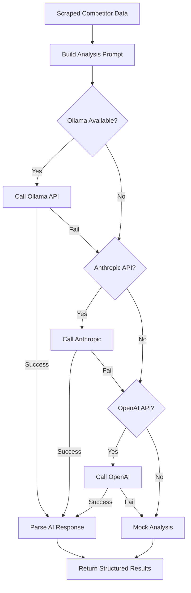

# Ollama AI Integration Setup Guide

## Overview

We've integrated **Ollama** (open source local AI) as the primary AI analysis engine for competitor analysis. This provides:
- **Free AI analysis** without API costs
- **Privacy** - all data stays local/private
- **Fast responses** - no external API delays
- **Multiple model options** - Llama 3.1, Mistral, CodeLlama, etc.

## Installation Options

### Option 1: Local Development Setup

1. **Install Ollama**:
   ```bash
   # macOS
   brew install ollama
   
   # Linux
   curl -fsSL https://ollama.com/install.sh | sh
   
   # Windows
   # Download from https://ollama.com/download
   ```

2. **Start Ollama Service**:
   ```bash
   ollama serve
   ```

3. **Download AI Model**:
   ```bash
   # Recommended: Llama 3.1 8B (fast, good quality)
   ollama pull llama3.1:8b
   
   # Alternative options:
   ollama pull mistral:7b      # Smaller, faster
   ollama pull llama3.1:70b    # Larger, better quality
   ollama pull codellama:13b   # Code-focused
   ```

4. **Test Installation**:
   ```bash
   curl http://localhost:11434/api/generate -d '{
     "model": "llama3.1:8b",
     "prompt": "Analyze this Facebook ad data and provide insights",
     "stream": false
   }'
   ```

### Option 2: Cloud/Production Deployment

#### Render.com Setup (Recommended)
Since Render supports Docker, you can deploy Ollama alongside your app:

1. **Create `Dockerfile.ollama`**:
   ```dockerfile
   FROM ollama/ollama:latest
   
   # Download model during build
   RUN ollama serve & sleep 5 && ollama pull llama3.1:8b
   
   EXPOSE 11434
   CMD ["ollama", "serve"]
   ```

2. **Add to your main app**:
   ```dockerfile
   # In your existing Dockerfile
   # Add Ollama as a service or sidecar container
   ```

#### Alternative: Hosted Ollama Services
- **Ollama Cloud**: Coming soon (official hosted service)
- **RunPod**: GPU instances with Ollama pre-installed
- **Vast.ai**: Cheap GPU instances for AI workloads

### Option 3: Alternative Open Source APIs

#### Hugging Face Inference API (Free Tier)
```javascript
// Add to environment variables
HUGGINGFACE_API_KEY=your_free_key_here
HUGGINGFACE_MODEL=microsoft/DialoGPT-large
```

#### Groq API (Fast Inference)
```javascript
// Very fast inference, generous free tier
GROQ_API_KEY=your_free_key_here
GROQ_MODEL=mixtral-8x7b-32768
```

## Environment Configuration

Add these environment variables to your `.env` file:

```bash
# Ollama Configuration (Primary)
OLLAMA_URL=http://localhost:11434
OLLAMA_MODEL=llama3.1:8b

# Backup Options (if Ollama unavailable)
HUGGINGFACE_API_KEY=optional_backup_key
GROQ_API_KEY=optional_backup_key

# Existing AI APIs (still supported)
ANTHROPIC_API_KEY=optional_claude_key
OPENAI_API_KEY=optional_gpt_key
```

## How It Works

### AI Analysis Flow



### Analysis Prompt Structure

The system sends this prompt to the AI:

```
Analyze these Facebook advertising strategies and provide competitive insights:

Your Brand: nike
- Total ads found: 3
- Ad examples: https://facebook.com/ads/library/?id=sample_0, ...

Competitor 1: adidas  
- Total ads found: 3
- Ad examples: https://facebook.com/ads/library/?id=sample_1, ...

Competitor 2: puma
- Total ads found: 3  
- Ad examples: https://facebook.com/ads/library/?id=sample_2, ...

Please provide:
1. A performance summary comparing all three brands
2. Key insights about competitor strategies
3. Specific recommendations for improving your brand's advertising

Format your response as JSON with this structure:
{
  "summary": {
    "your_page": {"page_name": "", "total_ads": 0, "performance_score": 0},
    "competitors": [{"page_name": "", "total_ads": 0, "performance_score": 0}, ...]
  },
  "insights": ["insight 1", "insight 2", ...],
  "recommendations": ["recommendation 1", "recommendation 2", ...]
}
```

### Response Processing

1. **JSON Parsing**: Tries to extract JSON response from AI
2. **Text Parsing**: Falls back to text extraction if JSON fails
3. **Structured Output**: Always returns consistent format for frontend

## Model Recommendations

### For Development
- **llama3.1:8b**: Best balance of speed/quality
- **mistral:7b**: Faster, smaller memory footprint

### For Production
- **llama3.1:8b**: Recommended for most use cases
- **llama3.1:70b**: Higher quality, needs more resources

### Model Comparison
| Model | Size | RAM Required | Speed | Quality |
|-------|------|--------------|-------|---------|
| mistral:7b | 4GB | 8GB | Fast | Good |
| llama3.1:8b | 5GB | 8GB | Medium | Very Good |
| llama3.1:70b | 40GB | 64GB | Slow | Excellent |
| codellama:13b | 7GB | 16GB | Medium | Good (code) |

## Testing the Integration

### 1. Test Ollama Direct
```bash
curl http://localhost:11434/api/generate -d '{
  "model": "llama3.1:8b",
  "prompt": "Analyze Facebook ad performance for Nike vs Adidas. Provide insights and recommendations in JSON format.",
  "stream": false
}'
```

### 2. Test Through App API
```bash
curl -X POST http://localhost:3000/api/workflow/competitor-analysis \
  -H "Content-Type: application/json" \
  -d '{
    "yourPageUrl": "https://facebook.com/nike",
    "competitor1Url": "https://facebook.com/adidas", 
    "competitor2Url": "https://facebook.com/puma"
  }'
```

### 3. Check Analysis Results
The workflow will show `"ai_provider": "ollama"` when using Ollama successfully.

## Troubleshooting

### Common Issues

1. **Ollama Not Running**:
   ```bash
   # Start Ollama service
   ollama serve
   
   # Check if running
   curl http://localhost:11434/api/tags
   ```

2. **Model Not Downloaded**:
   ```bash
   # Download required model
   ollama pull llama3.1:8b
   
   # List downloaded models
   ollama list
   ```

3. **Memory Issues**:
   ```bash
   # Use smaller model
   ollama pull mistral:7b
   
   # Set in environment
   OLLAMA_MODEL=mistral:7b
   ```

4. **Production Deployment**:
   - Ensure Ollama service is running on port 11434
   - Set `OLLAMA_URL` to your Ollama instance URL
   - Consider using GPU instances for better performance

## Performance Optimization

### For Better Speed
1. **Use GPU acceleration** (if available)
2. **Smaller models** (mistral:7b vs llama3.1:70b)
3. **Local deployment** (avoid network latency)

### For Better Quality
1. **Larger models** (llama3.1:70b)
2. **Fine-tuned prompts** (more specific instructions)
3. **Temperature adjustment** (lower = more focused)

## Cost Comparison

| Service | Cost | Quality | Speed | Privacy |
|---------|------|---------|-------|---------|
| **Ollama** | Free | High | Fast | Full |
| OpenAI GPT-4 | $30/1M tokens | Highest | Fast | None |
| Anthropic Claude | $15/1M tokens | Highest | Fast | None |
| Hugging Face | Free tier | Good | Medium | Partial |
| Groq | Free tier | High | Fastest | Partial |

## Next Steps

1. **Deploy Ollama** to your production environment
2. **Test the integration** with real competitor analysis
3. **Monitor performance** and adjust model as needed
4. **Consider fine-tuning** for your specific use case

The system will automatically use Ollama when available, falling back to other AI services or mock analysis as needed!